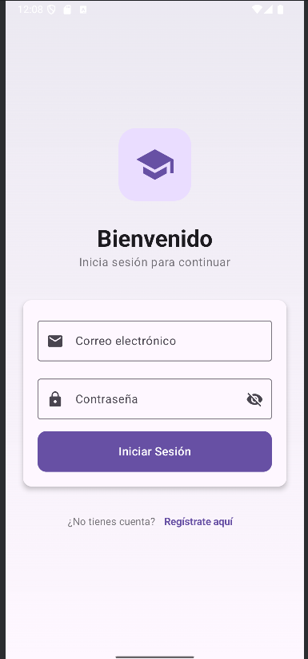
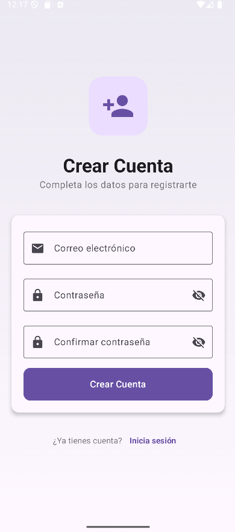
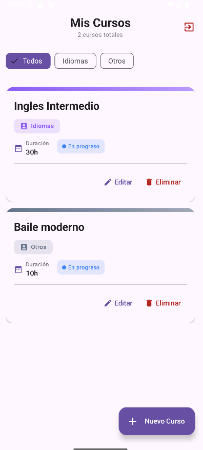
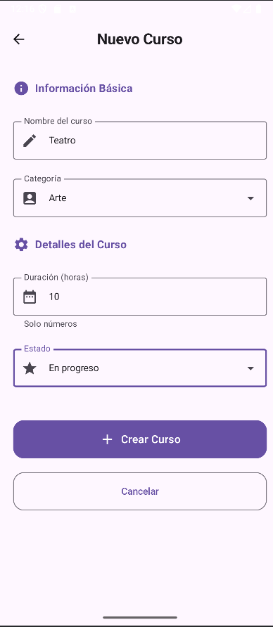
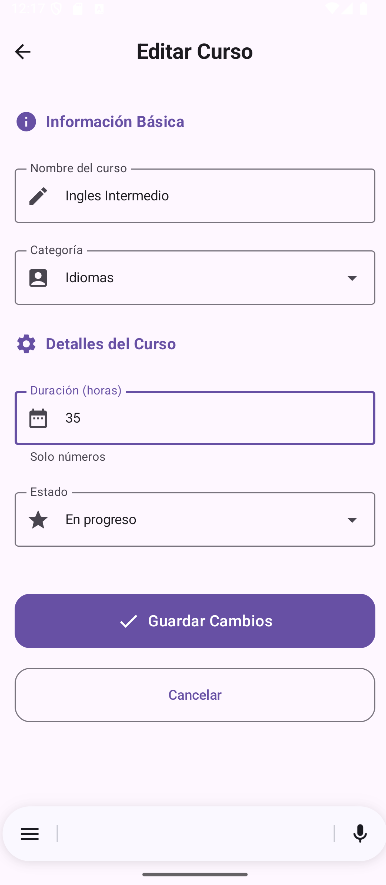

📚 CourseMaster
Aplicación móvil para gestión de cursos usando Firebase + Jetpack Compose + MVVM.

Autores:
- Mayela Ticona Mamani
- Milagros Ramos Chamorro

¿Qué es MVVM?
MVVM (Model-View-ViewModel) es un patrón de arquitectura de software que separa la lógica de la interfaz de usuario (View) de la lógica de negocio y datos (Model), usando un intermediario llamado ViewModel que maneja la comunicación y la presentación de los datos a la interfaz. Esto facilita el mantenimiento, la prueba y la escalabilidad de la aplicación.

¿Qué es Firebase Authentication?
Firebase Authentication es un servicio de Firebase que permite autenticar usuarios de manera segura en una aplicación, utilizando métodos como correo y contraseña, Google, Facebook, Apple u otros proveedores de identidad. Simplifica la gestión de usuarios y su seguridad.

¿Qué es Firestore?
Firestore es una base de datos en tiempo real y basada en la nube de Firebase, que permite almacenar, sincronizar y consultar datos estructurados para aplicaciones web y móviles. Ofrece soporte para operaciones CRUD y actualizaciones en tiempo real.

¿Qué es Jetpack Compose?
Jetpack Compose es un framework moderno de Android para crear interfaces de usuario de manera declarativa. Permite construir pantallas con componentes reutilizables y manejar el estado de la UI de forma más sencilla, reemplazando en gran parte el uso tradicional de XML.

¿Qué es CRUD?
CRUD es un acrónimo de Create, Read, Update y Delete, que representa las operaciones básicas que se pueden realizar sobre datos en una base de datos o sistema de almacenamiento.

Partes asistidas con IA
La inteligencia artificial se utilizó principalmente como apoyo en la detección y corrección de errores técnicos que no podíamos resolver por nuestra cuenta.

Corrección de errores de sintaxis (por ejemplo, faltas de comas u otros detalles menores).

Identificación de causas de fallos en la ejecución del programa (crasheos o bloqueos inesperados).

Orientación sobre cómo depurar y estabilizar el código cuando la aplicación se detenía sin mostrar claramente el motivo.

Partes programadas por el equipo
El desarrollo realizado directamente por nosotros incluyó:

Implementación de las ViewModel, conectando la lógica de los cursos con el diseño y la maquetación.

Configuración de dependencias y servicios de Firebase.

Desarrollo de la lógica de navegación mediante NavGraph.

Estrategia para evitar el uso excesivo de IA
La IA se utilizó únicamente como consultor técnico, no como reemplazo del trabajo de programación.

Se recurrió a ella para obtener orientación sobre errores y buenas prácticas.

La programación, diseño y estructura principal fueron realizados por el equipo.

El objetivo fue mantener la autonomía en el desarrollo, usando la IA solo como apoyo puntual para mejorar la calidad del código.

CAPTURAS DE LA EJECUCIÓN:
- 
- 
- 
- 
- 